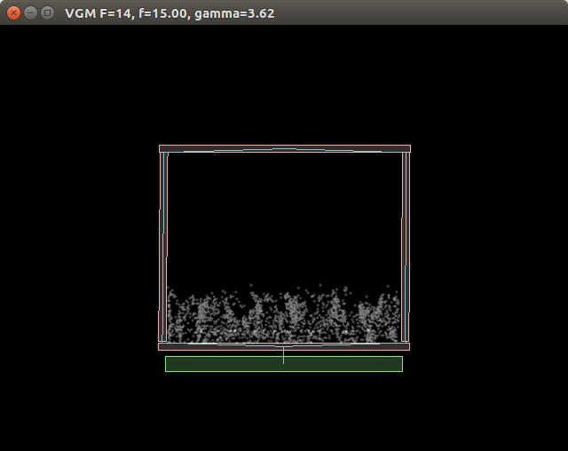

# NSL Project 2 : Vibrating Granular Media

---

Currently supporting semi-parametrized numerical simulation with LiquidFun

[Demo Video](https://www.youtube.com/watch?v=0i7x5nwChtU)




## Build:

First install [LiquidFun](http://google.github.io/liquidfun/).

Afterwards, the project follows the standard CMake building process:

```bash
mkdir build && cd build
cmake ../
make -j8
```

## Run:

```bash
cd build
./nsl_vgm
```
